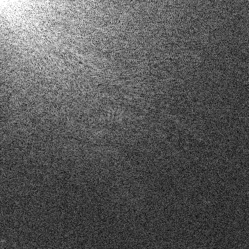

# Video Compression Homework #2 Report - 2D-DCT
Name: 謝振杰
Student ID: 313551085 


## Method
- 轉灰階：以 OpenCV 讀取並轉為灰階（uint8），同時輸出 `lena_gray.png`
- DCT 矩陣：產生正交歸一化 DCT-II 矩陣 `C`，元素為
  \( C[u, x] = \alpha(u) \cos \left( \frac{\pi (2x+1)u}{2n} \right) \)；\(\alpha(0)=\sqrt{1/n},\ \alpha(u>0)=\sqrt{2/n}\)
- 2D-DCT：`Y = C_H @ X @ C_W^T`
- 兩次 1D-DCT：先列向 DCT（`X @ C_W^T`）後行向 DCT（`C_H @ (...)`）
- 2D-IDCT：`X = C_H^T @ Y @ C_W`
- 兩次 1D-IDCT：先行向後列向，對應兩次 1D-DCT 的反變換
- 視覺化：對 |DCT| 取 `log1p` 後，以百分位（預設 99%）做縮放裁切，輸出 `dct_log.png`
- PSNR：以 8-bit 圖比較重建與原圖

### 3. 實驗設定
- 影像：`lena.png`（512×512）
- 平台：Python + NumPy + OpenCV（僅用於 I/O 與可選驗證）
- 計時：使用 `time.perf_counter()`

### 4. 結果（`metrics.txt`）
```
Image size: 512x512
2D-DCT time (s): 0.023201
Two 1D-DCT time (s): 0.007323
Max |DCT(2D) - DCT(1D)|: 1.7053e-11
IDCT(2D) time (s): 0.007168
IDCT(1D) time (s): 0.007411
PSNR (2D recon) dB: inf
PSNR (1D recon) dB: inf
```

### 5. 視覺化與輸出
- `lena_gray.png`：灰階輸入

- `dct_log.png`：DCT 係數對數域視覺化

- `recon_2d.png`：2D-IDCT 重建

- `recon_1d.png`：兩次 1D-IDCT 重建


- `metrics.txt`：尺寸、時間、最大係數差與 PSNR


### 6. 討論
- 正確性：兩種 DCT 的最大係數差約 `1.7e-11`，屬數值誤差範圍；重建 PSNR 為無限大（數值上完全重建）。
- 效能：兩次 1D-DCT（約 0.0073 s）較直接 2D-DCT（約 0.0232 s）更快，符合以分離性（separability）加速的預期。
- 視覺化：對數域與百分位裁切避免少數大係數主導視覺效果，便於觀察低頻能量集中於左上角。

### 7. 結論
- 已完成 2D-DCT/IDCT 與兩次 1D-DCT/IDCT 之實作、視覺化與評估，滿足作業要求。
- 兩次 1D-DCT 具明顯加速效果，且與 2D-DCT 結果一致；重建品質達無損（數值誤差可忽略）。
