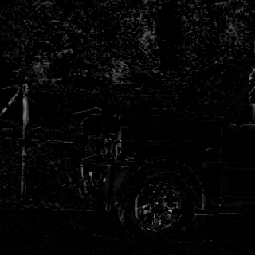
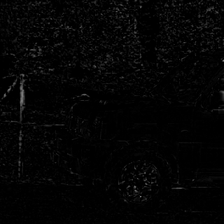
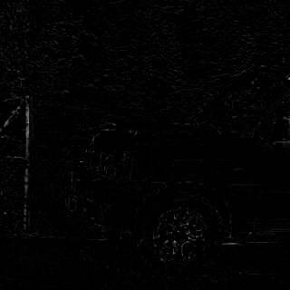
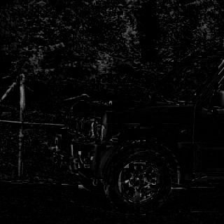
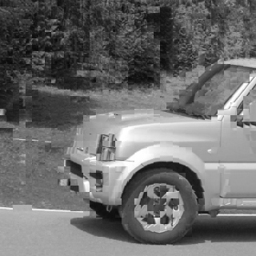
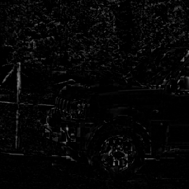
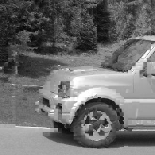
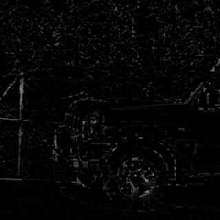

# Video Compression Homework #3 Report - Motion Estimation & Compensation
Name: 謝振杰  
Student ID: 313551085

## Method
- Motion estimation (ME): Block size `8×8`，整數像素精度，成本函數採用 SAD。
- Full search (FS): 在搜尋範圍 `±R`（R ∈ {8, 16, 32}）內逐點窮舉。
- Three-Step Search (TSS): 初始步長 `2^⌊log2(R)⌋`，每步比較中心與八鄰點，步長每次除以 2，直到 0（邊界超出者忽略）。
- Motion compensation (MC): 以估測之 `(dy, dx)` 將參考影格之對應區塊複製到重建影格；同時輸出殘差 `cur - recon`。
- PSNR: 以 8-bit 圖比較 `two_gray.png`（當前影格）與重建影格。

## Experiment Settings
- Images: `one_gray.png`（參考）、`two_gray.png`（當前），灰階。
- Block size: `8×8`
- Search ranges: `±8, ±16, ±32`
- Platform: Python + NumPy + OpenCV
- Timing: `time.perf_counter()`

## Results

- `recon_full_sr{R}.png`、`residual_full_sr{R}.png`（Full search）
- `recon_tss_sr{R}.png`、`residual_tss_sr{R}.png`（Three-Step Search）
- `metrics.txt`：尺寸、FS/TSS 於不同 R 的 PSNR 與 runtime（秒）

全部視覺化：

輸入影像（供參考）：

Full Search（±8）：

Full Search（±16）：

Full Search（±32）：

Three-Step Search（±8）：

Three-Step Search（±16）：

Three-Step Search（±32）：

數值結果：

| Range | Algorithm   | PSNR (dB) | Runtime (s) |
|-------|-------------|-----------|-------------|
| ±8    | Full search | 22.8113   | 2.120983    |
| ±8    | TSS         | 22.1591   | 0.247554    |
| ±16   | Full search | 25.4122   | 9.143385    |
| ±16   | TSS         | 22.8635   | 0.357068    |
| ±32   | Full search | 29.0194   | 36.331457   |
| ±32   | TSS         | 23.2050   | 0.397670    |

## Discussion
- 正確性：FS 與 TSS 均能重建接近當前影格；PSNR 受搜尋範圍影響，R 越大，通常能找到更佳匹配（PSNR 趨於上升）。
- 效能：FS 隨 R 呈平方成長，runtime 顯著增加；TSS 以對數步進，大幅降低比較次數，通常遠快於 FS。
- 折衷：TSS 在大多數情況提供良好的 PSNR/時間折衷；若場景運動複雜或存在局部極值，FS 可能更準確。

